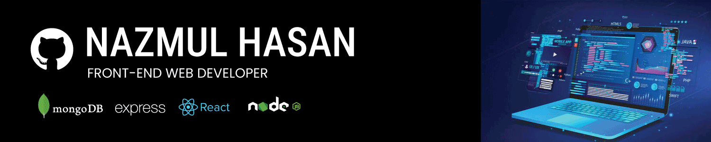

### Hi there 👋
##### my name is Nazmul Hasan
#### I am Frontend Web Developer

I am a frontend MERN Stack web developer from Dhaka, Bangladesh. I specialize in building modern, responsive, and user-friendly web interfaces using React, Next.js, and JavaScript, with a strong focus on clean UI and performance.

Skills: HTML / CSS / JS / REACT / NEXT JS / MongoDB / EXPRESS JS / NODE JS

- 🔭 I’m currently Student

Here are some ideas to get you started:

- 🔭 I’m currently student
- 🌱 I’m currently learning JavaScript
- 👯 I’m looking to collaborate on github
- 🤔 I’m looking for help with ..
- 💬 Ask me about web development, 
- 📫 How to reach me: ...
- 😄 Pronouns: ...
- ⚡ Fun fact: ...

