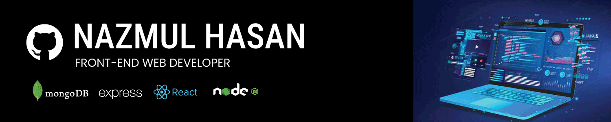

### Hi there 👋, my name is Nazmul Hasan
#### I am Frontend Web Developer

I am a frontend MERN Stack web developer from Dhaka, Bangladesh. I specialize in building modern, responsive, and user-friendly web interfaces using React, Next.js, and JavaScript, with a strong focus on clean UI and performance.

Skills: HTML / CSS / JS / REACT / NEXT JS / MongoDB / EXPRESS JS / NODE JS

Here are some ideas to get you started:

- 🔭 I’m currently working on React, NextJS, Express, Mongodb
- 🌱 I’m currently learning JavaScript and other javaScript librarys
- 👯 You can find me [Linkedin](https://www.linkedin.com/in/nazmuldeveloper)
- 🤔 My portfolio [NazmulHasan](https://nazmul-hasan-rho.vercel.app)
- 💬 You can send me any message by mdnazmulhasan0879@gmail.com

